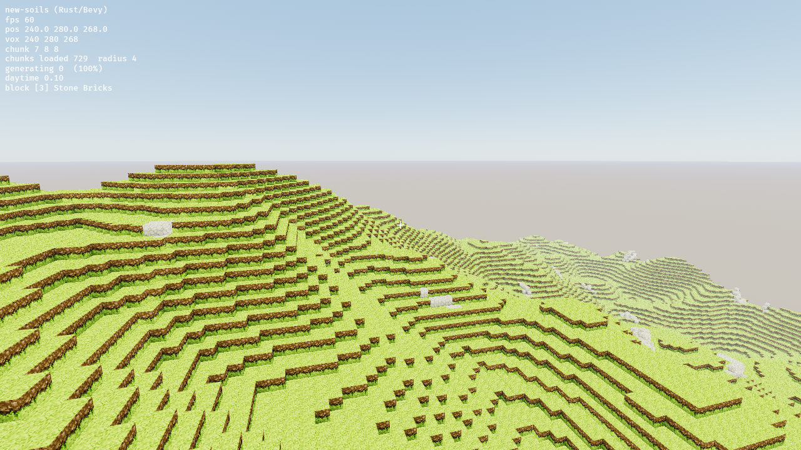
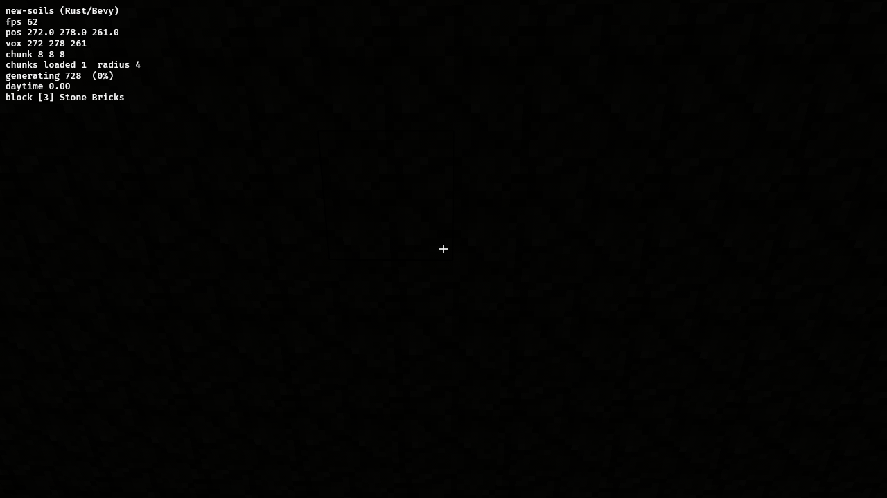
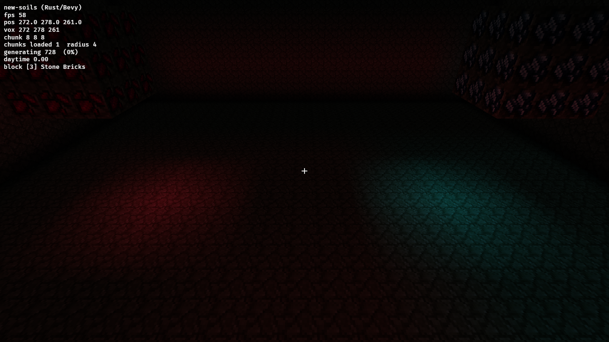

# new-soils (Rust + Bevy port)

A Rust/[Bevy](https://bevyengine.org) port of the original Node.js + Three.js
`new-soils` voxel sandbox — now a **client/server multiplayer game** with a
headless authoritative server, GPU-resident rendering, client-side prediction,
and a delta-replication pipeline. All 14 phases of the porting/optimization
plan ([`TODO.md`](TODO.md)) are complete; see
[`docs/architecture.md`](docs/architecture.md) for how it works and
[`docs/perf-report.md`](docs/perf-report.md) for the performance story.



*A fresh 729-chunk world at steady state — server-generated terrain streamed
over the network, greedy-meshed entirely on the GPU, drawn with indirect
draws, and shaded by the baked light grid.*

| GI off | GI on |
|---|---|
|  |  |

*The radiance-cascades GI demo (`SOILS_GI_DEMO=1`): a sealed dark room holding
two emissive ore clusters. With GI on, their light bounces onto the floor and
walls through a fully GPU-resident probe hierarchy — occupancy blit, cascade
trace/merge, and per-probe ambient-cube irradiance, all validated against CPU
oracles.*

## What works today

- **Server authority + prediction** — clients send *inputs*, not positions;
  the server integrates them through the shared simulation (movement cheating
  is structurally impossible), while the client predicts locally and
  reconciles against acked state. Validated through a 75 ms lossy-link proxy:
  straight movement reconciles bit-exact.
- **Delta replication** — entity state ships as quantized deltas against
  acked baselines under a 410 B/tick budget (measured < 150 B/tick in play),
  with interest management by chunk column and priority accumulation.
- **Chunk streaming v2** — server-owned subscriptions, palette+LZ4 chunk
  codec (a fresh-world join is ~500 KB, down from 23 MB), refcounted
  residency with eviction, coalesced persistence, and region-file compaction.
- **Two transports** — WebSocket by default; WebTransport/QUIC (`SOILS_WT=1`)
  moves snapshots and inputs onto real datagrams (no TCP head-of-line
  blocking). Snapshots are latest-wins on both: slow links never build a
  backlog of stale state.
- **GPU-resident rendering** — compute-shader greedy meshing (AO-aware,
  oracle-matched against the CPU reference), vertex pulling, exact-AABB
  frustum culling, backface culling, and indirect draws sized by the GPU quad
  count. No CPU meshing, no readbacks.
- **Baked light grid (L0)** — skylight + blocklight nibbles flooded
  incrementally on load/edit by code shared with the server, so caves darken
  and torch-like blocks glow with GI off, and the server can answer gameplay
  queries like "darkest walkable cell nearby".
- **Radiance-cascades GI** (opt-in) — a world-space probe hierarchy traced
  against a GPU-blitted occupancy volume, seeded by the baked skylight,
  round-robined across frames, and delivered to fragments as trilinearly
  interpolated per-probe ambient cubes. Off by default while it soaks
  (`/gi on`, pause menu, or `SOILS_GI=1`).
- **Entities & pathfinding** — a data-driven entity registry; ambient
  critters wander deterministically, and when a player comes near they
  pathfind to them: per-chunk walkability grids, budgeted A* with jump/fall
  moves, an HPA* region-portal fallback for long routes, and flow fields
  ready for crowds — all invalidated by chunk edit versions.
- **Worldgen** — multi-octave simplex heightmap, soil gradient, rock
  outcrops, and 3D-noise caves (lattice-interpolated; a 48-chunk wave
  generates in ~3.5 ms), persisted to zlib region files.
- **Editing** — raycast break/place with optimistic application and rollback:
  the server validates reach/rate/residency and acks or rejects each edit.
- **The rest** — login/signup accounts, multiple named worlds (`/warp`),
  LAN discovery, day/night cycle, HUD/console/pause menu.

## Workspace layout

| Crate | Role |
|-------|------|
| `soils-protocol` | Wire messages and codecs (palette+LZ4 chunks, quantized delta snapshots). No Bevy/tokio. |
| `soils-worldgen` | Block registry, terrain generation, and the CPU oracles (reference mesher, GI math). Pure, benched, unit-tested. |
| `soils-sim` | The shared simulation: movement/collision, edit rules, L0 light flood, entity registry, pathfinding. Both sides run this — prediction and authority can't drift. |
| `soils-server` | Headless Bevy ECS app at a 20 Hz tick behind a tokio edge; worldgen waves, lighting jobs, replication, persistence, WS + WebTransport. |
| `soils-client` | The Bevy game: streaming, GPU meshing + indirect draws, L0/GI shading, prediction, interpolation, editing, UI. |

## Running

**Single player**: run the client and click **Singleplayer** — an embedded
server starts in-process on an ephemeral port. The pause menu can advertise
the world on the LAN (Minecraft-style discovery, UDP 9002).

For a dedicated server:

```sh
cargo run -p soils-server          # ws:// and WebTransport on 127.0.0.1:9001
cargo run -p soils-client          # opens the game window
SOILS_WT=1 cargo run -p soils-client   # same, connecting over QUIC datagrams
```

> Run the client with `cargo run` (not the bare binary) so Bevy resolves the
> `assets/` folder; a directly-run binary renders empty sky. To run the binary
> directly, set `BEVY_ASSET_ROOT=crates/soils-client`.

Controls: **WASD** move, **mouse** look, **Shift** sprint, **Space/Ctrl**
up/down (fly) or jump, **F** toggle fly/walk, **left/right click**
break/place, **1-9** pick a block, **F3** debug overlay, **/** command
console, **Esc** pause/settings.

Console commands: `tp x y z`, `warp <world>`, `daytime t`, `loadradius n`,
`fog on|off`, `ao on|off`, `light on|off`, `gi on|off`.

### Linux build dependencies

Bevy needs the usual system libs: `libwayland-dev libxkbcommon-dev
libasound2-dev libudev-dev` (and `libxkbcommon-x11-0` at runtime for X11).

## Tests & headless verification

Every optimization and protocol change in the log is regression-locked; the
suite is the contract. ~100 tests across:

```sh
cargo test --workspace
```

- **Oracle tests** — the GPU mesher and every GI compute pass (trace,
  occupancy blit, irradiance projection) are executed headlessly on a real
  GPU and compared against CPU references (auto-skip without an adapter);
  the light flood pins incremental == full relight.
- **Codec tests** — golden bytes, round-trips, and fuzzed panic-free decode
  for chunk and snapshot payloads.
- **Network scenarios** (`soils-server/tests/scenarios.rs` and friends) — an
  embedded server plus scripted protocol clients pin movement authority,
  edit acking, subscriptions/unloads, restart persistence, world isolation,
  critter pursuit, join-time (< 3 s) and bandwidth (< 2 MB join,
  < 150 B/tick snapshots) budgets, and the WebTransport datagram loop.
- **Prediction tests** (`tests/prediction.rs`) — a delay/loss proxy and a
  headless predictor twin verify reconciliation at 150 ms RTT with 2% loss.
- **Visual self-test** — `SOILS_SELFTEST=1 cargo run -p soils-client`
  streams, meshes, renders, screenshots (`/tmp/soils-selftest.png`), and
  asserts terrain is actually visible (needs a server on 9001). The GI demo
  pair used in the screenshots above:

```sh
SOILS_SELFTEST=1 SOILS_GI_DEMO=1 SOILS_GI=0 cargo run -p soils-client  # dark room
SOILS_SELFTEST=1 SOILS_GI_DEMO=1 SOILS_GI=1 cargo run -p soils-client  # lit by GI
```

CI renders release screenshots headlessly under Mesa lavapipe
(`.github/workflows/screenshots.yml`).

## Documentation

- [`docs/architecture.md`](docs/architecture.md) — how every system works
  today: protocol, transports, server tick, chunk lifecycle, rendering, GI,
  prediction, pathfinding, testing.
- [`docs/perf-report.md`](docs/perf-report.md) — the optimization arc with
  measurements (23 MB → 498 KB joins, 849 → 187 ms bursts, the GI rework),
  methodology, and the ranked list of what to optimize next.
- [`TODO.md`](TODO.md) — the 14-phase implementation log; each checkoff
  records what shipped, what was measured, and what was deferred and why.
- [`docs/plan-rendering.md`](docs/plan-rendering.md) /
  [`docs/plan-game-systems.md`](docs/plan-game-systems.md) — the original
  plans the phases implement.

## Deliberate simplifications vs. the JS original

- Terrain uses the Rust `noise` crate: equivalent in character, not
  byte-identical to the JS `alea` + `simplex-noise` output.
- Accounts are salted-hashed passwords in a local file — a stand-in, not
  production security. WebTransport certificates are per-boot self-signed
  with client verification skipped (LAN trust; cert pinning exists for a
  future wasm client).
