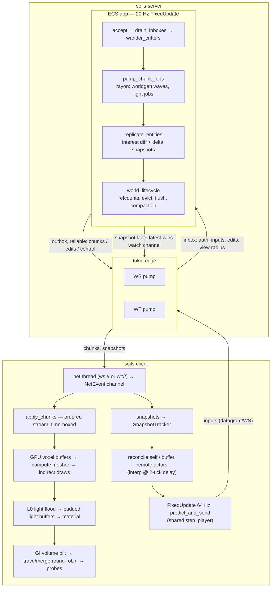

# Architecture

How the system works as implemented — all 14 phases of `TODO.md` are
complete. This is the "what is" companion to the "what should be" plans
(`plan-rendering.md`, `plan-game-systems.md`) and the measurements in
`perf-report.md`. File references are starting points, not an API contract.

## Workspace

| Crate            | Role                                                                                                                                                                                                                                                                                                                                            |
| ---------------- | ----------------------------------------------------------------------------------------------------------------------------------------------------------------------------------------------------------------------------------------------------------------------------------------------------------------------------------------------- |
| `soils-protocol` | Wire types + codecs: `ClientMsg`/`ServerMsg` (bincode), the palette+LZ4 chunk codec (`chunk_codec.rs`), the quantized delta-snapshot codec + `SnapshotTracker` (`snapshot.rs`), chunk/voxel coordinates. No Bevy, no tokio.                                                                                                                     |
| `soils-worldgen` | Block registry, terrain generation (lattice-interpolated cave noise, early-outs), and the *CPU oracles*: reference greedy mesher (`greedy.rs`) and radiance-cascades math (`radiance.rs`). Pure, unit-tested, criterion-benched.                                                                                                                |
| `soils-sim`      | The shared simulation both sides run: player movement/collision (`step_player`), input packing, edit validation, the L0 light flood (`light.rs`), entity registry (`entities.yaml`), and pathfinding (`nav.rs`: walk grids, budgeted A*, HPA*, flow fields). Engine-free, everything over a `VoxelSampler` trait (unloaded space reads as air). |
| `soils-script`   | Server-side scripting host: a wasmtime (Cranelift JIT) runtime that loads AssemblyScript (`.ts`, compiled at runtime via `asc`) or precompiled `.wasm`/`.wat`, exposes a scalar host ABI (`host.rs`) for reading/mutating world state, and runs scripts under a per-call fuel + memory budget (`lib.rs`). No Bevy/tokio.                        |
| `soils-physics`  | Shared Avian rigid-body physics: config + body/collider builders, `Collider::voxels` terrain conversion (`collider.rs`), the kinematic player-proxy, and the `add_physics` app setup. Used by both server (authority) and client (local prediction), like `soils-sim`. Behind `SOILS_PHYSICS`.                                                  |
| `soils-server`   | Headless authoritative server: a Bevy ECS app (`app.rs`) at a 20 Hz fixed tick behind a tokio network edge (`lib.rs`), world/chunk lifecycle + persistence (`world.rs`, `region.rs`, `persist.rs`), accounts (`auth.rs`).                                                                                                                       |
| `soils-client`   | The Bevy game: net bridge (`net.rs`), chunk streaming + GPU meshing (`server_msg.rs`, `gpu_mesh.rs`, `indirect_draw.rs`), materials + L0 shading (`material.rs`, `light.rs`), radiance-cascades GI (`gi.rs`), prediction (`player.rs`), remote-entity interpolation (`actor.rs`), optimistic edits (`edit.rs`), UI.                             |

One rule holds everything together: **client and server share one simulation**
(`soils-sim`) and one set of codecs (`soils-protocol`), so predicted movement,
server authority, lighting, and replicated state can't drift by construction —
the remaining risks are pinned by oracle tests.

## Data flow

## Protocol

- **Encoding**: bincode for message envelopes; two hand-packed hot paths.
- **Chunk payloads** (`chunk_codec.rs`): per-chunk palette, bit-packed
  indices, LZ4; tiers for uniform (air/solid), paletted, and raw-dense
  chunks. Fuzz-tested to never panic on arbitrary bytes.
- **Snapshots** (`snapshot.rs`): positions quantized to 1/256 voxel, encoded
  as zigzag-varint deltas against the **acked baseline tick** (carried on the
  wire as `baseline_tick`); velocity/yaw only when changed; LZ4 above 200 B.
  `SnapshotTracker` keeps per-entity (tick, state) rings so any baseline the
  server might use is reconstructable — this is what makes the unreliable
  snapshot lane safe.
- **Inputs**: packed frames (buttons/flags/quantized yaw), the last 3 bundled
  per send for loss tolerance, `ack_tick` piggybacked for snapshot acking.

## Transports

Two lanes with different semantics, one app-side shape (`NewConn`):

- **Reliable ordered**: login, chunk data/unloads, edits + acks, entity
  spawn/despawn, time, warp.
- **Latest-wins / unreliable**: snapshots (server→client) and inputs
  (client→server). Server-side this is a `watch` channel — a backed-up link
  replaces the unsent snapshot rather than queuing it.

Backends: **WebSocket** (default; both lanes share the socket) and
**WebTransport/QUIC** (`wt://`, opt-in via `SOILS_WT=1`): the reliable lane
is a client-opened bi stream of length-framed bincode, and snapshots/inputs
are real QUIC datagrams. TLS is a per-boot self-signed identity with client
verification skipped — LAN trust, same as `ws://`; the cert-hash pinning
path exists for a future wasm client. The ECS app cannot tell transports
apart.

## Server

- **Tick** (`FixedUpdate`, 20 Hz): accept new connections → drain inboxes
  (auth, input token bucket at the 64 Hz sim rate ×32 burst, edit validation:
  seq, rate bucket, reach, block id, residency) → critter AI → **scripts**
  (when enabled) → chunk job pumping → entity replication → clock → world
  lifecycle. Player movement integrates client inputs through the shared
  `step_player` at the client dt, so speed-hacking is structurally impossible
  (scenario-verified).
- **Player-vs-player collision**: `step_player_peers` sweeps the player AABB
  against other players' bodies as well as voxels, per axis. Being blocked on
  the vertical axis while falling sets `grounded`, so players stand — and jump
  — on one another. Two rules keep it stable: peers are read from a
  *tick-boundary snapshot* (so the result does not depend on ECS iteration
  order, and the client can predict the same thing), and a peer already
  interpenetrating at the start of a tick is ignored, so players sharing a
  spawn point can walk apart instead of locking each other in place forever.
  Fly mode stays noclip. The client feeds the same peer set into both
  prediction and rollback replay, taking each peer's *newest* snapshot rather
  than its render-delayed interpolated position — the newest is what the server
  resolved against, so contact does not spray reconciliations.
- **Chunk lifecycle**: subscriptions are server-owned boxes around each
  client (radius + hysteresis); wanted chunks are probed cache→disk on the
  tick and generated on rayon in nearest-first waves (≤8 in flight per
  client), delivered in request order. Residency is refcounted; zero-ref
  chunks evict after 60 s (save-if-dirty through the background persister);
  region files compact on open past a 25% leak ratio.
- **Lighting**: the shared L0 flood (skylight + blocklight nibbles) runs
  against dense cloned regions on rayon, version-guarded on write-back;
  edits relight inline (small), and per-chunk summaries (dark walkable-air
  counts + sampled cells) power gameplay queries like
  `darkest_walkable_near` without touching voxels on the wire.
- **Replication**: interest = chunk-column buckets within the subscription
  radius, diffed into spawn/despawn a few times a second; state goes out
  every tick as delta snapshots under a 410 B budget with a per-entity
  priority accumulator (base/dist², players boosted, reset on send).
- **Pathfinding**: per-chunk `(WalkGrid, ChunkNav)` cached keyed by the
  (own, below, above) edit-version triple (walk grids sample vertical
  neighbors). Critters seek nearby players via budgeted A*, fall back to
  HPA* (region-portal graph + flat refinement) when the budget can't reach,
  and validate each waypoint against live voxels so edits force repaths.

## Scripting (server-side WASM)

Opt-in (`SOILS_SCRIPTS=1` → `scripts/`, or `SOILS_SCRIPTS_DIR`). The `run_scripts`
system sits in the tick chain after AI and before replication, so a script's
mutations replicate the same tick.

- **Runtime**: one wasmtime `Engine` (Cranelift JIT) per server; each script
  gets its own `Store` + instance. `.ts` sources compile at runtime via `asc`
  (Node) on a background thread — never on the tick — and hot-reload on change;
  precompiled `.wasm`/`.wat` load directly. No `asc` → `.ts` skipped, binaries
  still load.
- **ABI** (`host.rs`, module `"soils"`, scalar i32/f32 only — no loader/GC
  bridge): reads (`get_voxel`, `entity_count`/`entity_field`, `seed`, `tick`,
  deterministic `rng`) resolve against a scoped, borrow-checked read view live
  only for the call; writes (`edit_voxel`, `spawn`/`despawn`, `set_velocity`/
  `set_pos`) are **buffered** as commands and applied by the embedder after the
  call, so wasm never re-enters the ECS mid-borrow.
- **Lifecycle exports** (all optional): `on_init`, `on_tick(tick, dt)`, and the
  reaction hooks `on_edit` / `on_player_join` / `on_player_leave` fed from an
  event buffer the tick systems fill (player edits, logins, disconnects).
  Script-originated edits do not re-enter `on_edit` (no recursion).
- **Downstream events → network state**: buffered commands funnel into the
  *existing* authority paths — `World::edit` + `send_world(ServerMsg::Edit)` for
  voxels, ECS `spawn`/`despawn`/`SimState` writes for entities — so replication
  carries them to clients with **no protocol or client changes**.
- **Isolation**: each callback runs under a fuel budget (a runaway loop traps,
  the script is disabled until reloaded, its partial output discarded) and a
  per-instance memory cap; a trap never stalls the tick or crashes the server.
  Held as a Bevy *non-send* resource, pinning script execution to the ECS thread.

## Client

- **Streaming**: chunk data and unloads share one ordered queue, applied
  under a per-frame wall-time budget (count budgets collapse on slow frame
  clocks). Each chunk gets GPU voxel buffers; meshing is a compute pass
  (greedy, AO-aware, oracle-matched) whose finalize step writes indirect
  draw args — chunks render via `draw_indirect` with exact AABBs, backface
  culling, and no CPU meshing or readback anywhere.
- **Shading**: the material samples the padded per-chunk L0 light volume
  (sky nibble scaled by the day curve + warm blocklight) plus meshed-in AO;
  with GI on it adds the radiance-cascades term.
- **GI** (opt-in): a 64³ occupancy+light volume around the player is
  refilled by a GPU blit of resident chunk buffers; 4 probe cascades trace
  against it (top-cascade escapes gated by baked skylight), merge top-down
  — one cascade per frame, trace and merge paired — and project into
  per-probe ambient cubes that fragments fetch trilinearly. CPU oracles
  cover trace, blit, and projection entry-for-entry.
- **Prediction**: 64 Hz `FixedUpdate` steps the shared sim, records
  (seq, input, state) in a ring, sends bundled inputs. Each snapshot
  rewinds to the server's state at `last_input_seq` and replays pending
  inputs; remote entities render from per-entity snapshot buffers at a
  2-tick interpolation delay with capped extrapolation. Edits apply
  optimistically with rollback on rejection.

## Physics (Avian, behind `SOILS_PHYSICS`)

Optional 3D rigid-body physics via [Avian](https://github.com/Jondolf/avian) 0.6,
authoritative on the server and locally predicted on the client — the same
share-one-simulation rule as movement, but through the `soils-physics` crate.

- **Engine**: Avian, single-threaded + `enhanced-determinism`, stepped in
  `FixedPostUpdate`. Body state lives in components (`Position`, `Rotation`,
  `LinearVelocity`), so it snapshots/rebases trivially.
- **Terrain**: solid voxels become `Collider::voxels` static colliders, one per
  chunk, maintained only within a small radius of live bodies and rebuilt when
  a chunk's edit `version` bumps (`maintain_physics_terrain` server-side,
  `maintain_client_terrain` client-side). Parry's voxel grid matches ours 1:1.
- **Replication**: physics entities (`KIND_PHYSICS_CUBE`) reuse the entity
  interest/snapshot pipeline; the snapshot codec gained an optional quantized
  orientation quaternion (`MASK_ROT`) that yaw-only entities never pay for. The
  server mirrors Avian state into `SimState`/`BodyRot` before `replicate_entities`.
- **Client prediction**: a local Avian world mirrors props in interest, predicts
  them forward, and rebases each to the authoritative snapshot past an epsilon
  (`soils-client/src/physics.rs`) — the prop analogue of `reconcile_self`. No
  input to replay, so it's rebase-and-continue, not input-replay rollback.
- **Player interaction**: the player carries a kinematic Avian proxy driven from
  `soils-sim` (`player_proxy`), so props are shoved by the player without
  changing the tuned movement. Full two-way (riding on props) would require
  moving the player onto an Avian character controller — deferred.
  Note this proxy is *not* how players collide with each other: it is one-way
  and its position is overwritten from `SimState` every tick. Player-vs-player
  collision lives in `step_player_peers` (below), independent of Avian, so it
  works with `SOILS_PHYSICS` off.
- **Spawning**: the `spawn`/`cube` console command (→ `ClientMsg::SpawnCube`,
  reach-checked + rate-limited) drops a cube ahead of the camera; a demo stack
  also falls near the first player on join.

## SpacetimeDB mirror (behind `SOILS_STDB_URI`)

A hybrid split, not a port. SpacetimeDB owns cold, relational, persistent and
social state; `soils-server` stays authoritative for movement, chunks, entities
and physics. The hot path never touches it. A full port was rejected on
concrete grounds: no threads for rayon worldgen, no nested WASM for the
scripting engine, nowhere to host Avian, no unreliable lane, and no
row-granular deltas.

- **Module** (`stdb/soils-module`): 10 tables. Every world-mutating reducer is
  gated on `require_server`, an allowlist bootstrapped trust-on-first-use, so
  players cannot write world state even though the tables are `public` for
  future client reads. Excluded from the workspace, so no `wasm32` toolchain is
  needed for a normal build; generated bindings are checked in, so no CLI is
  either.
- **Link** (`soils-stdb`): a worker thread plus channels, deliberately the same
  shape as the `NewConn` transport seam. The ECS sends `StdbCmd`s and drains
  `StdbEvent`s, unaware of the database. No Bevy dependency, so a client could
  use it too.
- **What is mirrored**: world registration on first open, edited-chunk blobs
  (only after a successful region write — disk stays authoritative), the server
  registry heartbeat, the logout profile save, and login/logout presence.
  Pristine chunks are reproducible from `GenParams` and are never stored.
- **Failure is non-fatal by design.** A database that is down or misconfigured
  logs and is otherwise ignored; losing it must never take the game down.
  Unset `SOILS_STDB_URI` and the server behaves exactly as it did before.
- **Liveness**: the server refreshes its registry row and its whole presence
  roster on one 5 s clock, comfortably inside the module's 30 s TTL, and the
  module reaps anything staler. Presence writes are batched into a single
  transaction per world rather than one reducer call per player.
- **Chunk versions** are the chunk's own edit counter, not a clock. A wall
  clock looked monotonic but a backwards step would fail the module's
  stale-write guard for every write until it caught up — and since the region
  file is authoritative and the chunk is no longer dirty, those edits would
  never be retried.

- **Reads** go through the SDK's client-side cache, which the worker keeps
  current from a `player_profile` subscription. That makes a lookup synchronous,
  which the login path needs — it cannot wait on a round trip mid-tick. Startup
  blocks (bounded) on the first snapshot: a login racing it would fall back to
  the world spawn and quietly lose the player's saved position. On login, a
  profile for that account in that world restores their position; a miss just
  spawns them normally.

Known limits, tracked in `TODO.md`: reads are confined to profiles, so the rest
is still a one-way write mirror. The whole social layer (accounts, chat, world
list, server browser) has no consumer, because `soils-client` does not depend on
`soils-stdb` at all. The `chunk_edit` journal and its reducers are built on both
sides and unreachable.

## Testing

- **Oracles**: GPU mesher vs CPU greedy mesher (sorted multiset equality);
  GI trace/blit/irradiance vs `radiance.rs`/CPU replicas; incremental light
  vs fresh relight; nav paths validated move-by-move.
- **Codecs**: golden bytes, round-trips, fuzzed panic-free decode.
- **Scenarios** (`soils-server/tests/`): an embedded server + scripted
  protocol clients pin movement authority, edit acks/rejects, subscriptions,
  persistence across restarts, world isolation, critter seek, bandwidth
  budgets, and the WebTransport datagram loop. Tests serialize on a static
  gate — parallel embedded servers starve the shared rayon pool.
- **Prediction**: a TCP delay proxy (75 ms each way, 2% input loss) drives a
  headless client twin through convergence and forced-misprediction cases.
- **Concurrency** (`soils-server/tests/concurrent.rs`): every client runs on its
  own OS thread with its own runtime, so connection handling, input integration
  and replication are exercised in real parallel rather than interleaved on one
  executor. Covers mutual observation, player-vs-player blocking, standing and
  jumping on another player's head, the same under a degraded link, and 100
  simultaneous clients (both clean and adverse links). Barrier waits carry
  deadlines: a peer thread that panics would otherwise hang the binary and bury
  the real failure.
- **Network conditions** (`soils-protocol/src/netsim.rs`): latency, gaussian
  jitter (Box-Muller) and loss, seeded so a failure reproduces. Delivery is
  monotonic — the modelled transports are ordered streams, so reordering them
  would test a network that cannot occur — and loss applies only to lanes built
  for it (`Inputs`, which re-sends the last 3 frames; `Snapshot`, delta-coded
  against acked baselines). Dropping a manifest would strand a chunk and prove
  nothing. Unit tests assert the distribution really is gaussian (mean, sigma,
  1-sigma/2-sigma coverage), not merely random. Available to the real client as
  `SOILS_NETSIM=<latency_ms>,<jitter_ms>,<loss>[,<seed>]`.
- **Physics** (`soils-server/tests/physics.rs`): a dropped cube falls and its
  orientation replicates as a unit quaternion, two clients converge on the same
  rest state, and the `SpawnCube` command creates a replicated cube.
  `soils-physics` unit tests cover drop-and-settle and voxel-collider alignment.
- **Scripting**: `soils-script` unit tests drive inline WAT modules (host
  reads, buffered writes, event reactions, deterministic rng, fuel-trap
  disable); `soils-server/tests/scripting.rs` loads a `.wat` fixture and asserts
  a script's edit/spawn reaches a real protocol client; an `asc`-gated test
  covers the AssemblyScript compile path (auto-skips without the toolchain).
- **Visual**: `SOILS_SELFTEST=1` renders, screenshots, and asserts terrain
  presence headlessly; the GI demo scene isolates the bounce for eyeballing;
  CI renders release screenshots under Mesa lavapipe.
- **Recording** (`soils-server/tests/demo.rs`, ignored by default): hosts a
  server, scripts two participants, and points a third client at them as a
  fixed camera (`SOILS_SPECTATE`) recording frames (`SOILS_RECORD`). A
  spectator is necessary rather than convenient — a first-person camera cannot
  show two bodies meeting. `scripts/mux_recording.py` muxes the result using
  each frame's *recorded* timestamp: PNG encoding perturbs the frame clock, so
  assuming a constant rate would stamp fabricated judder onto the video and
  make good interpolation look broken.

## Known deferrals

Each `TODO.md` checkoff records its own; the ones that shape future work:
pooled quad memory / merged draws (the current frame bound), GI 3D-texture +
DDA marching and default-on, async pathfinding + a flow-field consumer (the
mob spawner), snapshot MTU packing, wasm client with cert-hash pinning, and
the `bevy_replicon` re-evaluation if entity kinds multiply. Details and
rationale: `perf-report.md` §"What's left on the table".
